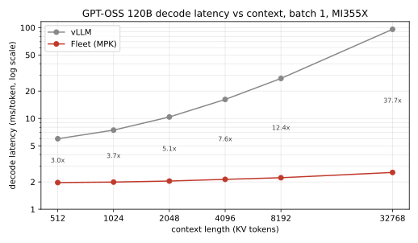

GPT-OSS 120B (128-expert top-4 MoE, MXFP4 weights, FP8 activations) as a Mirage Persistent Kernel on AMD **MI350/MI355 (gfx950)**, batch size 1 (~2 ms/token; 3x the installed vLLM at 512 tokens of context and 38x at 32k -- see [the sweep](#decode-latency-vs-context-length) and its version caveat). Like the existing Qwen model, it runs as an MPK **megakernel** -- but where Qwen dispatches the forward pass as **many tasks**, here **we fuse all 36 layers into a single task**: embedding through logits executes in one persistent loop over the 8 XCDs, never returning to the host.

Per op, precision is chosen for the hardware. QKV, O-proj, and the MoE experts (W13/W2) run **FP8 activations x MXFP4 weights** on the block-scaled matrix core **`v_mfma_scale_f32_16x16x128_f8f6f4`**, with FP4 weights unpacked by the hardware **`v_cvt_scalef32_pk_bf16_fp4`** intrinsic (this alone was 10.7 -> 5.2 ms). Attention runs in BF16 via CK-FMHA split-KV; the router+TopK and a fused **MXFP4 LM head + argmax** close each layer. GEMM inputs use XOR-swizzled LDS addressing and pipelined MFMA loops.

Feeding those matrix cores without stalls is the other half of the story, and **weight prefetching** is central: weights stream **HBM->LDS directly via `buffer_load_lds`**, bypassing the VGPR file, and are **prefetched a stage ahead** so expert-weight HBM traffic hides behind compute and synchronization instead of stalling on it -- the O-proj weights load while the cross-XCD attention barrier drains, and the W2 (down-projection) weights and scales are pulled during the W13->W2 handoff. Synchronization is then reduced to a **fleet hierarchical barrier** (240-way -> 8-way) plus per-XCD monotonic flag polling that replaces `__syncthreads`, with pre-filled worker queues removing the scheduler from the loop. Correctness is checked by a tolerant Torch-vs-Mirage token test (`tests/ci-tests/`).

## Quickstart: running GPT-OSS 120B

Requires an AMD ROCm GPU (gfx950 / MI350 / MI355) for the HIP megakernel.

### Build from source

```bash
git submodule update --init --recursive
pip install -e . -v
export MIRAGE_HOME=$(pwd)
```

### Run (batch size 1)

```bash
export MODEL_PATH=/path/to/gpt-oss-120b   # local GPT-OSS 120B weights (or HF repo id)
export GPU=0                              # target GPU id

rm -rf demo/gpt_oss/permanent_output_dir
HIP_VISIBLE_DEVICES=$GPU \
python3 demo/gpt_oss/demo.py --use-mirage \
  --model-path "$MODEL_PATH" \
  --prompt "Tell me the history of america" \
  --max-seq-length 512
```

Read the **`Decode avg`** line for per-token decode latency (~2.0 ms/tok). Drop
`--use-mirage` to run the PyTorch reference instead.

### Decode latency vs context length



Batch 1, MI355X (gfx950), 1 GPU, ROCm 7.0.0 / HIP 7.0.51831. Each point feeds a
prompt of exactly N tokens and decodes on top of it, so the number is the cost
of attending over ~N tokens of KV:

| ctx | 512 | 1024 | 2048 | 4096 | 8192 | 32768 |
|---|---|---|---|---|---|---|
| Fleet ms/tok | 1.968 | 1.993 | 2.045 | 2.135 | 2.226 | 2.545 |
| vLLM ms/tok | 5.98 | 7.44 | 10.39 | 16.19 | 27.58 | 95.91 |
| speedup | 3.0x | 3.7x | 5.1x | 7.6x | 12.4x | 37.7x |

Fleet grows 1.97 -> 2.55 ms across a 64x context range: attention is the only
term that scales, and it is split across 31 workers with the merge folded into
the same task.

**Read the vLLM column with its version.** These are
`vllm bench latency` on **vLLM 0.11.1rc2** (`38f225c2a`, ROCm 7.0.0 build) with
`--batch-size 1`, TPOT taken as a two-point difference over output length
(`(latency@129 - latency@1) / 128`) so both points cancel the same prefill.
That build has **no AITER MXFP4 MoE kernel path on ROCm** -- its
`Mxfp4Backend` selector returns Triton on every ROCm device -- so the MoE runs
dequantized rather than natively FP4, and both the absolute numbers and the way
they scale reflect that. A build with native FP4 MoE kernels is substantially
faster than this column and is the fair comparison to make; the ratios above
are against the stack as installed, not against vLLM's best possible
configuration.

Reproduce:

```bash
export MODEL_PATH=/path/to/gpt-oss-120b
bash tests/ci-tests/run_gpt_oss_seqlen_sweep.sh   # Fleet arm  (~40 min)
bash tests/ci-tests/run_vllm_seqlen_sweep.sh      # vLLM arm, prints the table
```

### Batching

GPT-OSS 120B supports **up to 16 tokens per iteration** (`--max-num-batched-tokens
1..16`) across **up to 8 concurrent requests** (`--max-num-batched-requests 1..8`).

Tokens ride the N axis of the `16x16x128` scaled-MFMA instruction, which was
already computing 16 columns for one token, so the dense GEMMs cost the same for
16 tokens as for 1 and only the MoE grows — with the number of *distinct* experts
the batch activates, not with the token count. Measured prefill: 2.09 / 4.06 /
5.11 / 6.55 / 8.51 ms at 1 / 2 / 4 / 8 / 16 tokens, i.e. 16 tokens for 4.1x the
cost of one.

Concurrent requests reuse that same flat token axis — there is no batch
dimension anywhere, exactly as in vLLM — so the only per-request structure is in
attention. The 30 workers on each XCD are split as
`(request, chunk) = (xcd_rank / chunks, xcd_rank % chunks)` with
`chunks = 30 / B`, trading split-KV depth for batch width the same way vLLM
picks partitioned vs non-partitioned attention on occupancy rather than on
sequence length. Measured decode:

| B | 1 | 2 | 4 | 8 |
|---|---|---|---|---|
| ms/iter | 2.13 | 2.50 | 5.36 | 8.19 |
| tokens/s | 470 | 800 | 747 | 977 |

Per-layer attribution (`MPK_DEVICE_TIMING=1`, µs, B=1 → B=8) shows where the
growth actually goes:

| | qkv gemm | attn | merge | oproj+topk | moe |
|---|---|---|---|---|---|
| B=1 | 9.0 | 4.8 | — | 14.8 | 22.0 |
| B=8 | 10.7 | 11.2 | 2.6 | 16.3 | 34.0 |

The MoE is the largest term (`min(topk*B, 128)` distinct experts, so expert
weight traffic roughly 4 → 32 experts), and the dense GEMMs barely move — that
is the batching win, already paid for by the N-axis token packing. Attention
grows too, mostly because the per-request chunk budget falls from 8 to 3: less
split-KV parallelism per request, not more work.

```bash
python3 demo/gpt_oss/demo.py --use-mirage --model-path "$MODEL_PATH" \
  --max-num-batched-requests 4 --max-num-batched-tokens 4 \
  --prompts "What is the capital of Japan?" "Who wrote Romeo and Juliet?" \
            "Name three prime numbers." "What is 12 times 12?"
```

`--num-requests N` runs more requests than there are batch slots: requests
retire as they finish, their KV pages return to the free list, and queued
requests are admitted into the freed slots without leaving the megakernel.

`PPL_MODE=1` requires `--max-num-batched-requests 1` — the logits sink row is
derived from request 0's step, so all requests would write the same row.

### Correctness

Three gates, cheapest first — end-to-end tokens, then per-stage layer
comparison, then perplexity against a reference matched on both MXFP4 weights
and FP8 activations:

```bash
export MODEL_PATH=/path/to/gpt-oss-120b
bash tests/ci-tests/run_ci_tests_gpt_oss.sh               # tokens, seconds
bash tests/ci-tests/run_ci_tests_gpt_oss_layer_compare.sh # per-op, ~4 min
bash tests/ci-tests/run_ci_tests_gpt_oss_perplexity.sh    # ~10 min/arm
```

The middle one is the sharp instrument: it gates cosine similarity and relative
RMSE per stage inside a decoder layer at depth 1 (`sliding_attention`) and
depth 2 (`full_attention`), so a numerical regression names the op that caused
it rather than just moving a corpus-wide number. `MPK_LSE_LOG_BUG=1` rebuilds
with a real historical defect injected to prove the gate still goes red.

See [`docs/mpk/correctness-infra.md`](docs/mpk/correctness-infra.md) for how to
localize a failure, the `PPL_SLICE` multi-window protocol, and the measured
noise floor. See [`demo/gpt_oss/README.md`](demo/gpt_oss/README.md) for the full
set of options (prompt selection, build variants, environment, and notes).
